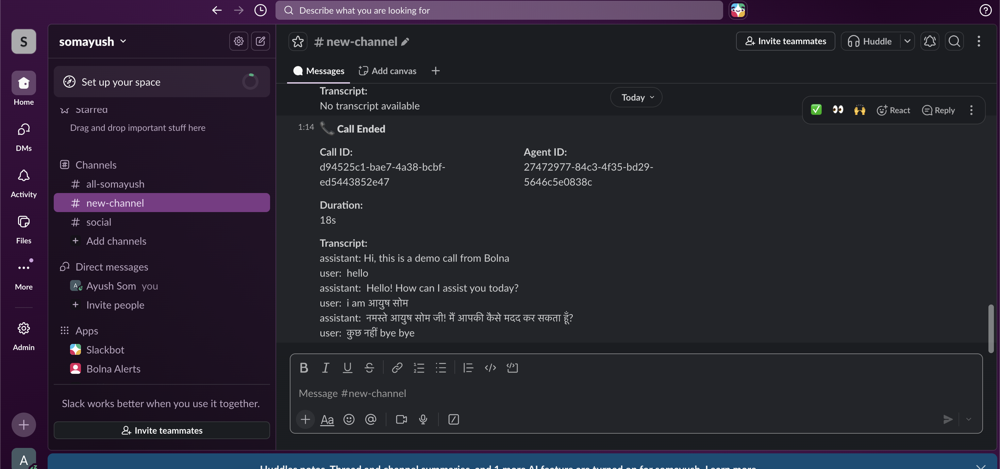

# Bolna → Slack Integration

Receives Bolna call completion webhooks and sends Slack notifications.


## Quick Deploy

```bash
# Vercel (recommended)
vercel --prod
```

## Environment Variables

| Variable | Required | Description |
|----------|----------|-------------|
| SLACK_WEBHOOK_URL | Yes | Slack incoming webhook URL |

## Endpoint

```
POST /api/bolna-webhook
```

## Payload Fields

| Field | Description |
|-------|-------------|
| id | Call ID |
| agent_id | Agent ID |
| conversation_duration | Call duration (seconds) |
| transcript | Full conversation transcript |

## Setup

1. Deploy to Vercel
2. Add `SLACK_WEBHOOK_URL` in Vercel settings
3. Configure Bolna agent webhook: `{url}/api/bolna-webhook`
4. Make calls - completed calls post to Slack